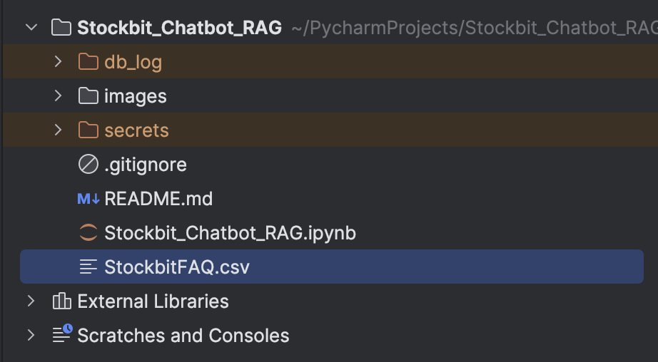
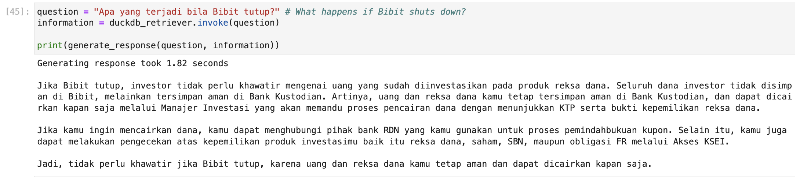
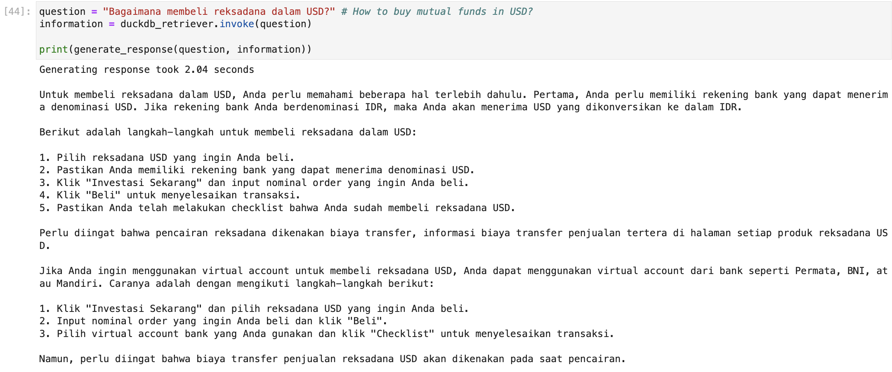

# Stockbit Chatbot RAG
A chatbot designed to answer Frequently Asked Questions (FAQ) from Stockbit clients using Retrieval-Augmented Generation (RAG). This project utilizes LangChain, DuckDB, and the Llama3 - 70b model through the LangChain Groq API. The implementation is done in Jupyter Notebook.

## Introduction
The Stockbit Chatbot is built to efficiently handle and respond to common questions from Stockbit clients. The chatbot leverages Retrieval-Augmented Generation (RAG) to provide accurate and contextually relevant answers by processing a CSV file containing FAQs and their respective answers.

## Prerequisites
Before you begin, ensure you have the following installed on your system:

* Jupyter Notebook/Lab
* Python 3.8 or higher

## Installation
To install the necessary libraries, you can run the following commands in your Jupyter Notebook:
```
!pip install langchain duckdb faiss-cpu langchain_experimental time 
!pip install transformers pandas langchain-huggingface python-dotenv dotenv
!pip install langchain_community langchain_groq langchain_core sentence-transformers
```

## Usage
1. Clone the repository:
```
git clone https://github.com/AbrahamWG/Stockbit_Chatbot_RAG.git
cd Stockbit_Chatbot_RAG
```
2. Open Jupyter Notebook:
```
jupyter notebook
```
3. Load the notebook:
Open the Stockbit_Chatbot_RAG.ipynb file in Jupyter Notebook.

4. Make a db_log folder in the current directory:
This is needed to make the duckdb going later on.





6. Run the cells:
Follow the instructions and run the cells sequentially to process the CSV file, generate embeddings, and interact with the chatbot.




## API Key Setup
To use the LangChain Groq API, you need to obtain your own API key:

Visit Groq Console and login, preferably using GitHub.
Copy your API key.
Create a '.env' file in the root directory of your project and add your API key:
```
GROQ_API_KEY=your_api_key_here
```

---
If you want to use this bot answer your own company's FAQ, you would need to upload your own csv file containing the data and adjust Part 2 "Chunking the Data" by replacing the name of the columns you want to use. 

Feel free to reach out if you have any questions or need further assistance. Happy coding!
